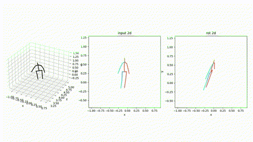

# What is aligned-view
In 3D Human Pose Estimation (3D HPE), the typical input is 2D images, which might encounter occlusion problems visually. For instance, when an individual stands sideways in front of the camera, body parts that are farther away from the camera (termed as the "far side") might be occluded by the body parts closer to the camera (the "near side").

In such cases, for better 3D pose estimation, we need a mechanism to "see through" this occlusion and generate an unobstructed image as input, which is referred to as the "aligned-view".

Our aligned-view generator is based on PoseAug. In order to obtain such *aligned-view* projections, we've applied PCA on original 3D keypoints from Human3.6M dataset. Two methods to apply this transformation has been completed, but still have certain amount of issuses within.

### Rotation of 3D:
The method contains two steps.
- 1) First, obtain original orientation of 3D keypoints, or human. Since it can't be obtained directly from dataset, we used PCA to find such orientation;
- 2) Second, calculate the rotation axis of orientation of human and camera orientation. Then, rotate human in world space to face to camera to achieve the *aligned-view* by simply using Rodrigues'.

### Rotation of camera:
The method applied virtual cameras with their orientations straight forward to human orientation, obtained by PCA. This process was completed Hua. 
